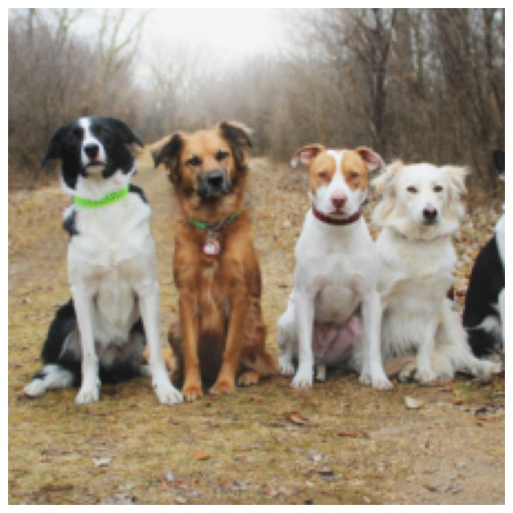
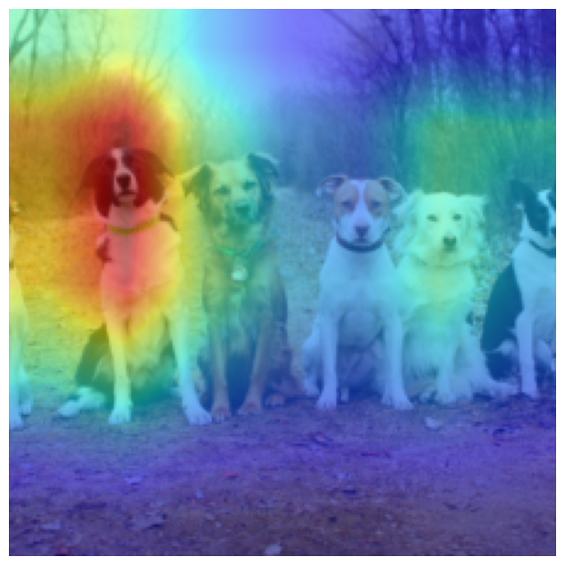
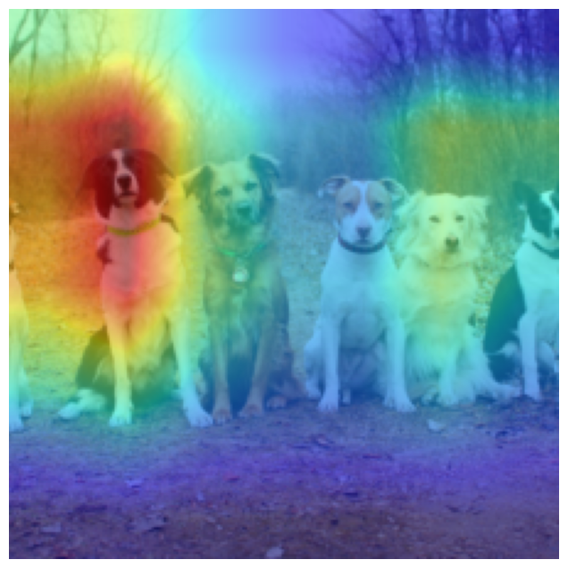
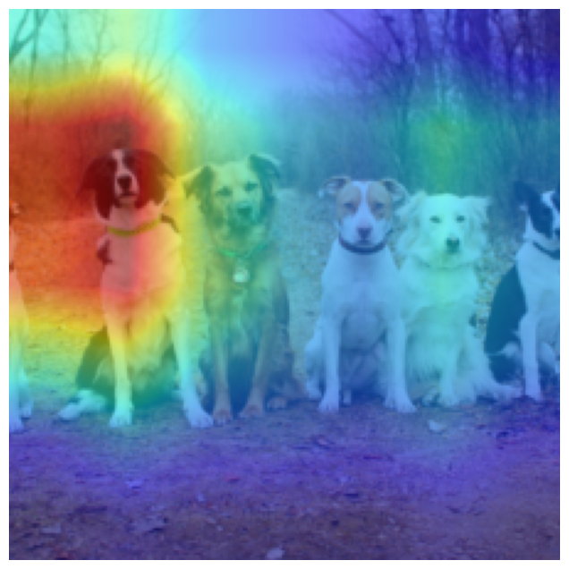
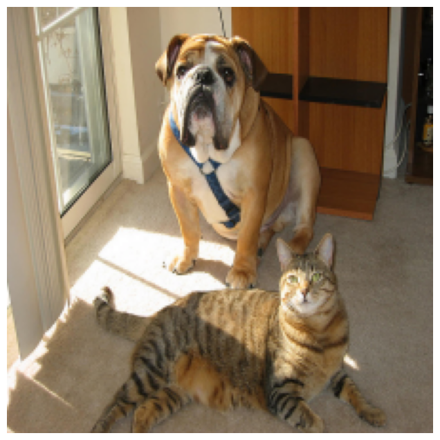
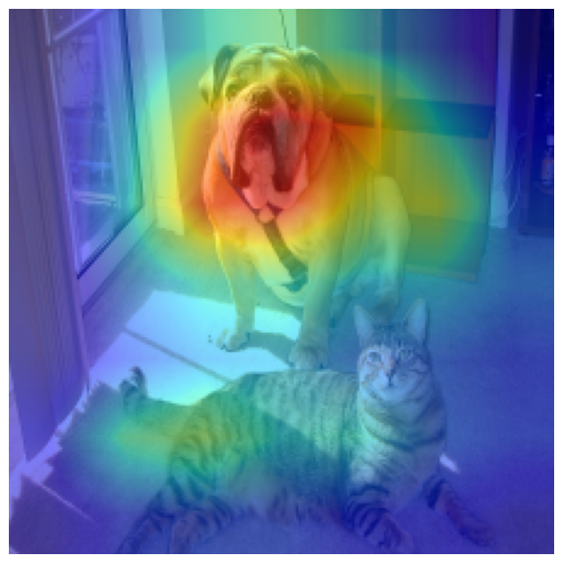
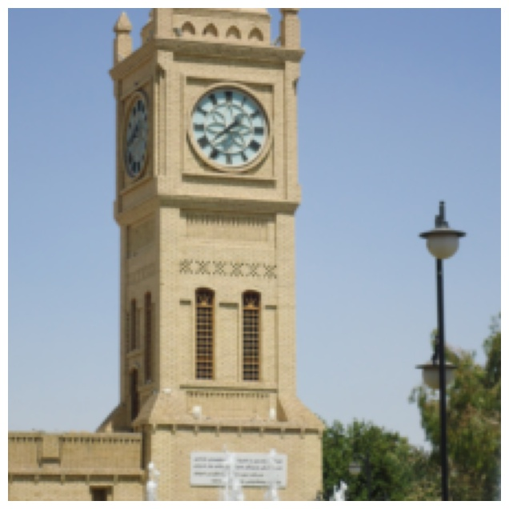
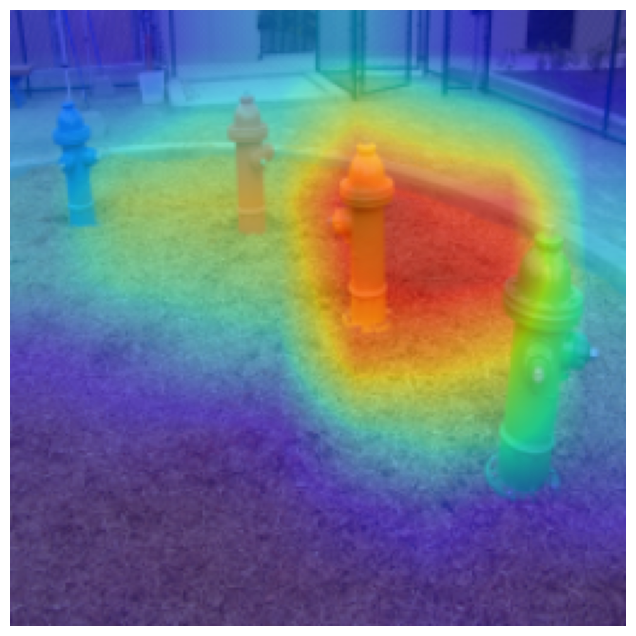
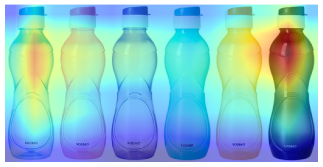

# CNNInterpreter
### Collection of populer Convolutional Neural Network (CNN) interpretation methods useful for debugging and understanding predictions of CNN.

## This package contains implementation of following methods

1. Decovlolution Network
2. Guided Backpropogation
3. Salienecy Map
4. Class Specific Saliency Map
5. Class Activation Map (CAM)
6. Gradient weighted Class Activation Map (Grad-CAM)
7. Gradient weighted Class Activation Map ++ (Grad-CAM++)
8. Score weighted Class Activation Map(Score-CAM)
9. Guided CAM, Grad-CAM, Grad-CAM++, Score-CAM
10. Deep Dream

## Class Activation Map Based Methods

<table border=0 >
	<tbody>
    <tr>
            <td align="center"> Original </td>
			<td align="center"> CAM </td>
			<td align="center"> Grad-CAM </td>
			<td align="center"> Grad-CAM++</td>
            <td align="center"> Score-CAM</td>
		</tr>
		<tr>
            <td width="20%">  </td>
			<td width="20%">  </td>
			<td width="20%">  </td>
			<td width="20%">  </td>
            <td width="20%">  </td>
		</tr>
        <tr>
            <td width="20%">  </td>
			<td width="20%">  </td>
			<td width="20%">  </td>
			<td width="20%">  </td>
            <td width="20%">  </td>
		</tr>
        <tr>
            <td width="20%">  </td>
			<td width="20%">  </td>
			<td width="20%">  </td>
			<td width="20%">  </td>
            <td width="20%">  </td>
		</tr>
	</tbody>
</table>