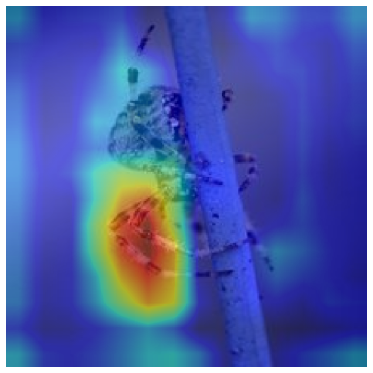
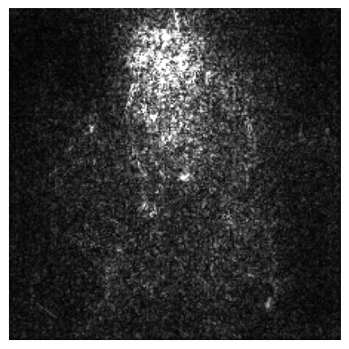

# CNNInterpreter
### Collection of populer Convolutional Neural Network (CNN) interpretation methods useful for debugging and understanding predictions of CNN.

## This package contains implementation of following methods

1. Decovlolution Network
2. Guided Backpropogation
3. Salienecy Map
4. Class Specific Saliency Map
5. Class Activation Map (CAM)
6. Gradient weighted Class Activation Map (Grad-CAM)
7. Gradient weighted Class Activation Map ++ (Grad-CAM++)
8. Score weighted Class Activation Map(Score-CAM)
9. Guided CAM, Grad-CAM, Grad-CAM++, Score-CAM
10. Deep Dream

### Requirements:
PyTorch
numpy
scipy
PIL
matplotlib
tqdm

## Class Activation Map Based Methods

### API:

	Args:
        model (nn.Module): any pretrained convolutional neural network.
        layer_name (str or None): name of the conv layer you want to visualize.
            If None, the last occuring conv layer in the model will be used.

    Attributes:
        model (nn.Module): the pretrained network
        layer_name(str or none): name of the conv layer
        hooks (list): contains handles for forward and backward hooks
        interractive (bool): determines wether to remove the hooks after obtaining cam.
        methods (list): list of acceptable methods

    Example:
        model = torchvision.models.resnet34(pretrained=True)
        image = read_image('test.img')
        cam = ClassActivationMaps(model)
        cam.show_cam(image, method='gradcam++')

<table border=0 >
	<tbody>
    <tr>
            <td align="center"> Image </td>
			<td align="center"> VGG16 </td>
			<td align="center"> Resnet34 </td>
			<td align="center"> GoogleNet</td>
            <td align="center"> SuffleNet</td>
		</tr>
		<tr>
            <td width="20%">  </td>
			<td width="20%">  </td>
			<td width="20%">  </td>
			<td width="20%">  </td>
			<td width="20%">  </td>
		</tr>
		<tr>
            <td width="20%">  </td>
			<td width="20%">  </td>
			<td width="20%">  </td>
			<td width="20%">  </td>
			<td width="20%">  </td>
		</tr>
		<tr>
            <td width="20%">  </td>
			<td width="20%">  </td>
			<td width="20%">  </td>
			<td width="20%">  </td>
			<td width="20%">  </td>
		</tr>
		<tr>
            <td width="20%">  </td>
			<td width="20%">  </td>
			<td width="20%">  </td>
			<td width="20%">  </td>
			<td width="20%">  </td>
		</tr>
		<tr>
            <td width="20%">  </td>
			<td width="20%">  </td>
			<td width="20%">  </td>
			<td width="20%">  </td>
			<td width="20%">  </td>
		</tr>
		<tr>
            <td width="20%">  </td>
			<td width="20%">  </td>
			<td width="20%">  </td>
			<td width="20%">  </td>
			<td width="20%">  </td>
		</tr>
	</tbody>
</table>

<table border=0 >
	<tbody>
    <tr>
            <td align="center"> Original </td>
			<td align="center"> CAM </td>
			<td align="center"> Grad-CAM </td>
			<td align="center"> Grad-CAM++</td>
            <td align="center"> Score-CAM</td>
		</tr>
		<tr>
            <td width="20%">  </td>
			<td width="20%">  </td>
			<td width="20%">  </td>
			<td width="20%">  </td>
            <td width="20%">  </td>
		</tr>
		<tr>
            <td width="20%">  </td>
			<td width="20%">  </td>
			<td width="20%">  </td>
			<td width="20%">  </td>
            <td width="20%">  </td>
		</tr>
		<tr>
            <td width="20%">  </td>
			<td width="20%">  </td>
			<td width="20%">  </td>
			<td width="20%">  </td>
            <td width="20%">  </td>
		</tr>
		<tr>
            <td width="20%">  </td>
			<td width="20%">  </td>
			<td width="20%">  </td>
			<td width="20%">  </td>
            <td width="20%">  </td>
		</tr>
		<tr>
            <td width="20%">  </td>
			<td width="20%">  </td>
			<td width="20%">  </td>
			<td width="20%">  </td>
            <td width="20%">  </td>
		</tr>
		<tr>
            <td width="20%">  </td>
			<td width="20%">  </td>
			<td width="20%">  </td>
			<td width="20%">  </td>
            <td width="20%">  </td>
		</tr>
	</tbody>
</table>

## Sensitivity Maps Based Methods

### API

        Collection of Sensitivity Map based methods. It computes gradients of the
        input with respect to the class score.
        It supports three methods
            - Vanilla Saliency Map
            - Integrated Gradients
            - Smooth Gradients (SmoothGrad)
        Args:
            model (nn.Module): any pretrained convolutional neural network.
                Deconvoltion Netowork can be generated for model which contains only
                Conv, Maxpool, ReLU or Batchnorm layer.
                We assume that all feature extracting layers are in model.features dict
        Example::
            model = torchvision.models.vgg16(pretrained=True)
            image = read_image('test.img')
            net = SensitivityMaps(model)
            net.show_map(img, method='smooth', colored=False)

### Integrated Gradients

<table border=0 >
	<tbody>
    <tr>
            <td align="center"> Image </td>
			<td align="center"> VGG16 </td>
			<td align="center"> Resnet34 </td>
			<td align="center"> GoogleNet</td>
            <td align="center"> SuffleNet</td>
		</tr>
		<tr>
            <td width="20%">  </td>
			<td width="20%">  </td>
			<td width="20%">  </td>
			<td width="20%">  </td>
			<td width="20%">  </td>
		</tr>
		<tr>
            <td width="20%">  </td>
			<td width="20%">  </td>
			<td width="20%">  </td>
			<td width="20%">  </td>
			<td width="20%">  </td>
		</tr>
		<tr>
            <td width="20%">  </td>
			<td width="20%">  </td>
			<td width="20%">  </td>
			<td width="20%">  </td>
			<td width="20%">  </td>
		</tr>
		<tr>
            <td width="20%">  </td>
			<td width="20%">  </td>
			<td width="20%">  </td>
			<td width="20%">  </td>
			<td width="20%">  </td>
		</tr>
		<tr>
            <td width="20%">  </td>
			<td width="20%">  </td>
			<td width="20%">  </td>
			<td width="20%">  </td>
			<td width="20%">  </td>
		</tr>
		<tr>
            <td width="20%">  </td>
			<td width="20%">  </td>
			<td width="20%">  </td>
			<td width="20%">  </td>
			<td width="20%">  </td>
		</tr>
	</tbody>
</table>

### Smooth Gradients (SmoothGrad)

<table border=0 >
	<tbody>
    <tr>
            <td align="center"> Image </td>
			<td align="center"> VGG16 </td>
			<td align="center"> Resnet34 </td>
			<td align="center"> GoogleNet</td>
            <td align="center"> SuffleNet</td>
		</tr>
		<tr>
            <td width="20%">  </td>
			<td width="20%">  </td>
			<td width="20%">  </td>
			<td width="20%">  </td>
			<td width="20%">  </td>
		</tr>
		<tr>
            <td width="20%">  </td>
			<td width="20%">  </td>
			<td width="20%">  </td>
			<td width="20%">  </td>
			<td width="20%">  </td>
		</tr>
		<tr>
            <td width="20%">  </td>
			<td width="20%">  </td>
			<td width="20%">  </td>
			<td width="20%">  </td>
			<td width="20%">  </td>
		</tr>
		<tr>
            <td width="20%">  </td>
			<td width="20%">  </td>
			<td width="20%">  </td>
			<td width="20%">  </td>
			<td width="20%">  </td>
		</tr>
		<tr>
            <td width="20%">  </td>
			<td width="20%">  </td>
			<td width="20%">  </td>
			<td width="20%">  </td>
			<td width="20%">  </td>
		</tr>
		<tr>
            <td width="20%">  </td>
			<td width="20%">  </td>
			<td width="20%">  </td>
			<td width="20%">  </td>
			<td width="20%">  </td>
		</tr>
	</tbody>
</table>

## Deconvolution Network Based Methods

### API
        Creates Deconvolution Network from pretrained ConvNet.
        It supports two methods
            - Standerd Deconvolution Network
            - Guided Backpropogation
        Args:
            model (nn.Module): any pretrained convolutional neural network.
                Deconvoltion Netowork can be generated for model which contains only
                Conv, Maxpool, ReLU or Batchnorm layer.
                We assume that all feature extracting layers are in model.features dict
            guided (bool): It True it will create DeconvNet for guided backpropogation.
                Otherwise we create standard DeconvNet
        Example::

            model = torchvision.models.vgg16(pretrained=True)
            image = read_image('test.img')
            cam = DeconvolutionNetwork(model, guided=True)
            cam.show_maps(image, target_layer = 'features_28')
### Guided Backpropogation

<table border=0 >
	<tbody>
    <tr>
            <td align="center"> Image </td>
			<td align="center"> AlexNet </td>
			<td align="center"> VGG13 </td>
			<td align="center"> VGG16 </td>
            <td align="center"> VGG19 </td>
		</tr>
		<tr>
            <td width="20%">  </td>
			<td width="20%">  </td>
			<td width="20%">  </td>
			<td width="20%">  </td>
			<td width="20%">  </td>
		</tr>
		<tr>
            <td width="20%">  </td>
			<td width="20%">  </td>
			<td width="20%">  </td>
			<td width="20%">  </td>
			<td width="20%">  </td>
		</tr>
		<tr>
            <td width="20%">  </td>
			<td width="20%">  </td>
			<td width="20%">  </td>
			<td width="20%">  </td>
			<td width="20%">  </td>
		</tr>
		<tr>
            <td width="20%">  </td>
			<td width="20%">  </td>
			<td width="20%">  </td>
			<td width="20%">  </td>
			<td width="20%">  </td>
		</tr>
		<tr>
            <td width="20%">  </td>
			<td width="20%">  </td>
			<td width="20%">  </td>
			<td width="20%">  </td>
			<td width="20%">  </td>
		</tr>
		<tr>
            <td width="20%">  </td>
			<td width="20%">  </td>
			<td width="20%">  </td>
			<td width="20%">  </td>
			<td width="20%">  </td>
		</tr>
	</tbody>
</table>